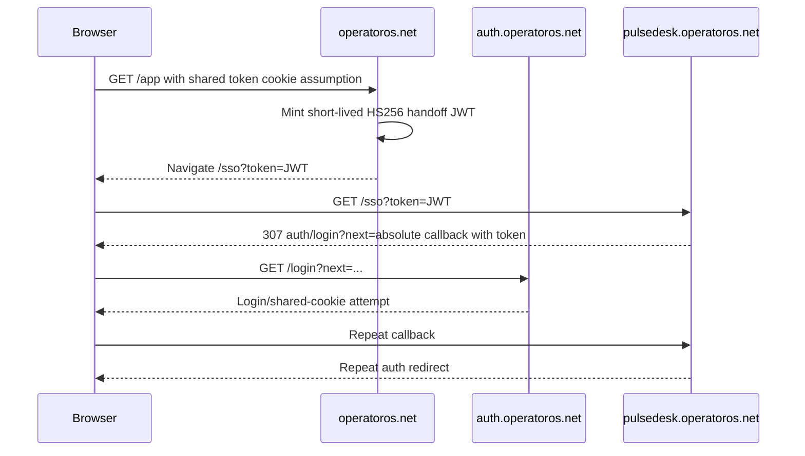

# OperatorOS authentication current state

Date: 2026-07-14. No cookie values, credentials, authorization codes, or tokens are recorded here.

## Executive finding (pre-repair)

The deployed pre-repair PulseDesk loop was caused by two incompatible session
assumptions. The old Next middleware required a parent-domain `token` cookie
before serving a module host and redirected a missing cookie to
`auth.operatoros.net/login?next=<absolute module URL>`. The old login page then
assumed the same parent-domain cookie would authorize the destination host. At
the same time, module launch minted a short-lived HS256 JWT and nested
`/sso?token=<JWT>` inside `next`. When the cookie was absent, host-scoped,
rejected, or emitted under a different environment signal, the callback was
intercepted before it could establish a module session and the redirect loop
repeated.

The repository also had two hub issuers (`/v1/sso/issue` and `/v1/modules/:slug/handoff`) and three different receiver implementations. PulseDesk alone defaulted to opaque code exchange; TradeFlowKit and TechDeck still used JWT query parameters.

## Consolidated source state

The active source architecture is one Next/Fastify deployment serving the four
platform hosts and all twelve enabled module clients. Each product retains its
exact hostname and product boundary, but it is not a separately executed
application. OutCall's hostname is attached and its metadata is reserved, but
the module remains planned/disabled.

Each module host creates its own state/nonce/PKCE transaction, central auth
issues one sealed 60-second single-use code, and the shared `/sso` callback
exchanges it through the same-origin API. A module exchange rechecks the user,
tenant, global module status, and entitlement before creating a host-only
module-and-tenant-bound `operatoros_session`. The `operatoros:web` client
instead creates a host-only platform session with no tenant or module claims.

Production root/app `/login` is now a canonical `operatoros:web` authorization
entry rather than a same-origin credential shortcut. The browser authenticates
on `auth.operatoros.net`, returns through the exact root/app `/sso` callback,
and therefore establishes both the independent auth-host session and the
requested platform-host session before any module launch.

A local production-host Playwright gate now verifies this topology over HTTPS:
one credential entry, root callback, silent launches for all twelve enabled
modules, independent Secure/HttpOnly/SameSite=Lax host-only cookies, no bearer
in URLs or browser storage, clean reloads, direct deep-link return, browser Back
without a central-auth loop, sibling-tab SSO, host-only local logout, and global
logout revocation. The final 2026-07-14 run passed 2/2 in 29.6 seconds. This is
source/runtime evidence, not a claim that the older public Replit release has
been replaced.

Local logout now persists only a SHA-256 fingerprint of the presented host
session in `revoked_session_tokens`. The shared auth pre-handler rejects that
fingerprint immediately, so copying a JWT before logout cannot replay it;
sibling-host sessions remain valid until their own local logout or the existing
global `tokenVersion` revocation. Expired fingerprints are pruned by the SSO
cleanup worker and raw session credentials are never written to the database.

## Before

## Current source-of-truth map

| Concern | Current active authority | Imported/rollback state |
|---|---|---|
| Identity/account status | OperatorOS `users` | Imported local password routes are not executed |
| Platform role | `users.platform_role` plus shared RBAC | Imported role mappings may only narrow future workflow permissions |
| Tenant and tenant role | `tenants`, `tenant_users` | Imported org records are migration inputs, not authority |
| Entitlements | OperatorOS resolver and tenant module grants | Imported snapshots cannot infer or grant access |
| Browser session | Host-only `operatoros_session` plus hashed local revocation | No localStorage, parent-domain bearer copy, or raw-token persistence |
| Handoff | `sso_handoff_tokens` plus sealed transaction binding | Legacy JWT/consume helpers remain for bounded rollback only |

## Cookies and scopes

| Surface | Prior credential/session | Current cookie | Authority scope |
|---|---|---|---|
| `operatoros.net`, `app.operatoros.net`, `auth.operatoros.net` | Parent-domain `token` assumption | Host-only `operatoros_session` | `sessionType=platform`; no tenant or module claims |
| Each exact enabled module host | Imported/local child sessions or shared handoff bearer | Host-only `operatoros_session` | `sessionType=module`; bound to one module and tenant |
| Authorization transaction | None/inconsistent | Host-only state, nonce, and verifier cookies for five minutes | Exact client, callback, and local return binding |

Credential submission and global account mutations are accepted only on the
exact root, app, and auth hosts (plus loopback in development). A module or
public Replit host cannot mint or upgrade a broad platform session.

## Token and signing inventory

- OperatorOS application session: HS256 JWT, seven-day lifetime, token-version revocation.
- Legacy module handoff: HS256 JWT, 90 seconds, shared `MODULE_SSO_SECRET`.
- Opaque handoff: AES-256-GCM sealed `{jti,aud,clientId,redirectUri,returnTo,state,nonce,codeChallenge}` plus atomic `consumed_at` update.
- Contract v1 transport: opaque 60-second single-use code only for the platform
  client and all twelve enabled module clients. JWT query transport is disabled
  in the active unified runtime; OutCall remains planned/disabled.
- Password reset tokens remain separate one-time account-recovery credentials.

## Callback and redirect inventory

- OperatorOS: root and app have exact `/sso` callbacks; `/login` and public
  credential/account flows are limited to root, app, and auth hosts.
- TradeFlowKit: `/sso` callback, final local `/dashboard`.
- TechDeck: `/sso` callback, final local `/`.
- PulseDesk: `/sso` callback, final local `/dashboard`.
- Every other enabled module uses its exact registered host plus `/sso`; the
  registry is the exhaustive callback inventory. OutCall's callback is
  reserved but authorization/exchange remain disabled.
- The old redirect allowlist was host-family based through `sanitizeReturnTo`; contract v1 uses exact registered callback URIs and local relative return paths.

## Deployed pre-repair baseline captured 2026-07-13

| Request | Status | Location | Relevant cookie observation |
|---|---:|---|---|
| `https://operatoros.net/app` | 307 | `/login?next=https%3A%2F%2Foperatoros.net%2Fapp` | no OperatorOS session issued |
| `https://auth.operatoros.net/login` | 200 | none | login HTML was cacheable for one year |
| `https://pulsedesk.operatoros.net/` | 307 | `https://auth.operatoros.net/login?next=https%3A%2F%2Fpulsedesk.operatoros.net%2F` | `os_sso_redirects`, Domain `.operatoros.net` |
| `https://tradeflowkit.operatoros.net/` | 307 | same pattern | same parent-domain counter |
| `https://techdeck.operatoros.net/` | 307 | same pattern | same parent-domain counter |
| `https://operatoros.net/sso?code=probe` | 404 | none | callback route is not deployed |
| `https://pulsedesk.operatoros.net/sso?code=probe` | 404 | none | callback route is not deployed |
| `https://tradeflowkit.operatoros.net/sso?code=probe` | 404 | none | callback route is not deployed |
| `https://techdeck.operatoros.net/sso?code=probe` | 404 | none | callback route is not deployed |

An authenticated public-production trace could not be captured because the
current source is not deployed. A disposable local identity and database were
used for the production-host browser gate; no credential, cookie, code, or
token was recorded. Public deployment and the same authenticated custom-domain
confirmation remain pending.

These live observations predate deployment of the consolidated callback. They
remain production blockers, not descriptions of the current source tree.

## Security and reliability findings from the deployed baseline

- Critical: JWT identity and entitlement claims in URLs and nested in `next`.
- Critical: a plaintext deployment credential existed in `.replit`; removed. Rotate the affected credential outside Git.
- High: parent-domain session cookie granted ambient authority to every subdomain.
- High: hub-to-module HS256 secret was shared across receivers.
- High: browser localStorage duplicated the session bearer.
- High: arbitrary same-family absolute `next` created a broad redirect surface.
- High: two issuer/consume implementations could drift.
- Medium: auth login HTML is publicly cacheable (`s-maxage=31536000`). Auth responses should be `no-store`.
- Medium: in-memory rate limits are per instance and do not provide distributed protection under autoscaling.
- Medium: production and preview callback separation was documented but not enforced in one machine-readable registry.

The current source repairs the JWT URL, localStorage bearer, parent-domain
session, callback, exact-redirect, and transaction-binding findings. Secret
rotation, deployment, DB-backed verification, and new live traces remain
operational gates.

## Replit and proxy findings

- Replit/Google Frontend terminates TLS and returns HSTS.
- Production code trusts forwarded headers only when `TRUST_PROXY` is exactly
  `1` or `true`; it is fail-closed by default and now configures Fastify's
  native `request.ip` resolution as well as host/origin guards.
- Secure-cookie selection previously depended on `APP_ENV`/`NODE_ENV` alignment.
- Internal `localhost:5001` API routing is deployment plumbing and must never appear in public redirects.
- The deployed baseline exposes the same Next application under multiple custom hosts; that does not make a shared parent cookie safe.
