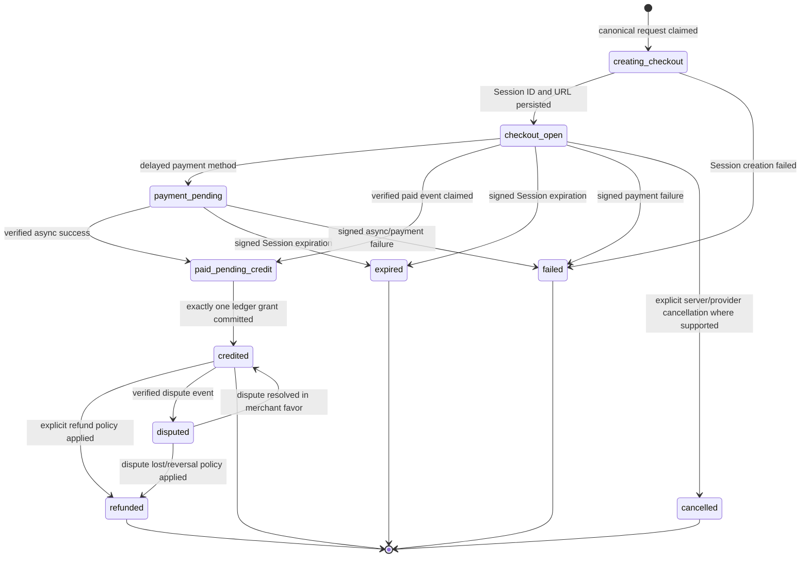
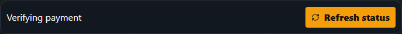

# Phase 43 TorqueShed checkout state machine

Status: **source/local accepted; real Stripe test checkout remains provider-gated**

Assessment date: 2026-08-15 (America/New_York)

## Outcome

OperatorOS now exposes one canonical TorqueShed credit checkout path:

`POST /v1/modules/torqueshed/token-purchases/checkout`

The authenticated client may send only `diagnosticSessionId`, `packageKey`,
and the `Idempotency-Key` header. Any amount, currency, units, tenant, user,
module, Stripe Product ID, Stripe Price ID, or success field is rejected. The
server resolves the trusted session scope and `torqueshed-credit-v1` manifest,
then snapshots tenant, user, module, diagnostic, units, amount, currency,
provider mode/account, Product ID, Price ID, catalog version, and both return
URLs in the durable purchase intent.

Cumulative additive database release v50 adds those immutable checkout
snapshot fields and the truthful state constraint. The original TorqueShed
initializer was also made forward-compatible so an idempotent cumulative
release cannot temporarily restore the older status constraint.

## Canonical request and response

```http
POST /v1/modules/torqueshed/token-purchases/checkout
Idempotency-Key: <stable operation key>
Content-Type: application/json

{
  "diagnosticSessionId": "<owned diagnostic UUID>",
  "packageKey": "roadside-25000"
}
```

The server persists `creating_checkout` before calling Stripe. It creates one
`mode=payment` Checkout Session with one line item using the validated durable
Price ID. Session and PaymentIntent metadata carry the purchase, trusted
tenant/user/module, diagnostic, package, units, catalog, and environment
references. The Session ID and URL are persisted only after successful
creation, when the intent advances to `checkout_open`.

Replaying the same idempotency key with the same package and diagnostic
returns the original intent and Session. Reusing it for a different package
or diagnostic fails with `TORQUE_PURCHASE_IDEMPOTENCY_CONFLICT`. Session
creation failure changes the already-persisted intent to `failed`, stores only
a safe failure code, creates no grant, and returns “Checkout was not created.
Nothing was charged.”

## State model



The authenticated status endpoint is:

`GET /v1/modules/torqueshed/token-purchases/:purchaseId/status`

It is constrained by the validated tenant and user session. A foreign tenant
or user receives 404 and cannot enumerate the purchase. The safe response
contains state, package, diagnostic, amount, units, currency, catalog/mode,
failure code, timestamps, whether exactly one purchase credit exists, and the
authoritative ledger balance. `credited` is not reported as complete unless
the exactly-once grant is present.

## Browser return and settlement UX

Both Checkout return URLs are the canonical diagnostic route with only the
opaque purchase identifier:

`https://<canonical-torqueshed-host>/diagnostics/<diagnosticId>?purchase=<purchaseId>`

No `success`, `paid`, `credited`, amount, Price, token, tenant, or user claim is
accepted from the query string. Loading a forged `?success=1` or
`?tokenPurchase=success` can perform only the authenticated status read; it
cannot update a purchase or ledger row.

The browser restores the diagnostic route and saved follow-up answer draft,
then displays:

- **Verifying payment** for `creating_checkout`, `checkout_open`, or
  `payment_pending`;
- **Payment received; credits are being applied** for
  `paid_pending_credit`;
- **Credits added** only for a server-confirmed `credited` purchase with the
  ledger grant reflected in the returned balance;
- explicit cancelled, expired, failed, refunded, and disputed copy for those
  states.

Polling is bounded, stops on terminal state, and leaves a manual **Refresh
status** action. The authoritative balance is refreshed after settlement and
after each Assist completion. Recent purchases come from the server ledger,
so a refresh, relogin, or new browser process can recover the purchase rather
than depending on browser memory.




These screenshots are compiled exact-host deterministic-provider evidence;
they are not a real Stripe Checkout or deployed-production capture.

## Legacy route disposition

Repository inventory found exactly one active checkout endpoint and one
active browser client. The retired
`POST /v1/billing/torque-assist/webhook` endpoint remains absent (404); signed
events are classified through the canonical raw-body
`POST /v1/billing/webhook` route.

There is no client-controlled amount compatibility route to preserve. Purchase
rows created before v50 retain their existing package/amount/mode snapshot.
Their already-open Sessions remain settleable under the original five-field
signed metadata contract. All v50 purchases have a non-null catalog snapshot
and must satisfy the expanded Phase 43 metadata contract. This is a bounded
in-flight settlement compatibility rule, not a second checkout contract.

## Executed evidence

| Command | Result |
| --- | --- |
| focused release/static/database workflow suite | PASS: 8/8, 0 failed, 0 skipped |
| `corepack pnpm typecheck` | PASS: API, runner gateway, web, and TorqueShed native |
| cumulative v50 apply on fresh disposable PostgreSQL 16 | PASS: 50/50 in 23.258s |
| immediate v50 reapply | PASS: 50/50 in 2.347s |
| `corepack pnpm build:production` | PASS: Faultline compiler 4/4, release metadata, typecheck, API, runner, web, and native builds |
| `PHASE43_CAPTURE_SCREENSHOTS=1; corepack pnpm test:hotfix:torque-exact-host` | PASS: 1/1 compiled exact-host payment-return journey |
| `git diff --check` | PASS before documentation finalization |

The focused workflow proves rejected client price injection, server snapshot
amount, same-key replay, changed-input conflict, cross-tenant 404, wrong-mode
denial, paid-pending visibility, forged query with zero credit, Session
creation failure with zero credit, signed expiration with zero credit,
exactly-once signed grant/replay, refund reversal, and pre-v50 webhook
compatibility.

## Acceptance and remaining gates

| Criterion | Result |
| --- | --- |
| Exactly one server-owned checkout contract | PASS |
| Intent exists before provider call and failed creation grants zero | PASS |
| Browser return cannot mutate payment or ledger state | PASS |
| UI cannot claim completion before exactly one grant | PASS |
| State and balance survive refresh/relogin | PASS in compiled exact-host test and server-backed recent-purchase UI |
| Focused API/integration/browser tests | PASS locally |
| Real Stripe test Checkout and signed provider settlement | BLOCKED: no Stripe test credential/catalog apply was authorized or available |
| Production deployment or live charge | NOT ATTEMPTED; explicit owner gate |

The Phase 41 purchase kill switch remains closed in every non-disposable
environment until the real Stripe test catalog is provisioned/validated and
Phase 44 provider settlement/reconciliation acceptance passes. No production
database, provider object, charge, deployment, tag, push, or merge was mutated
by Phase 43.
